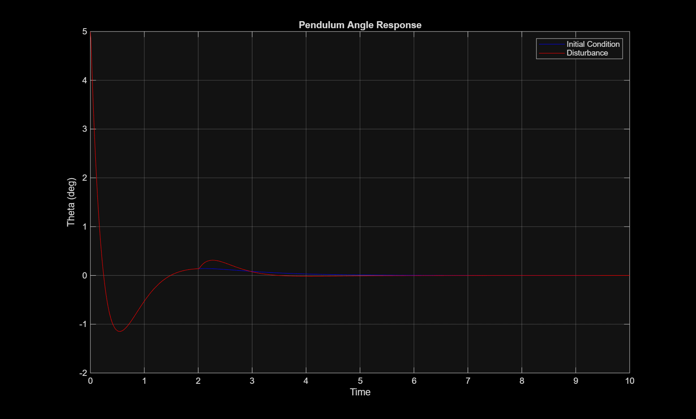
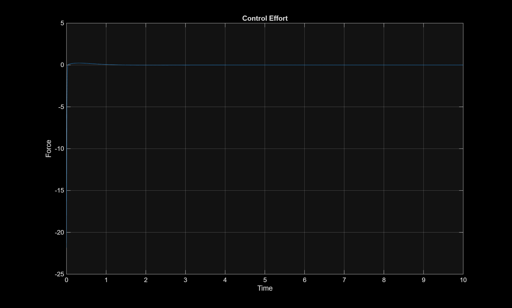
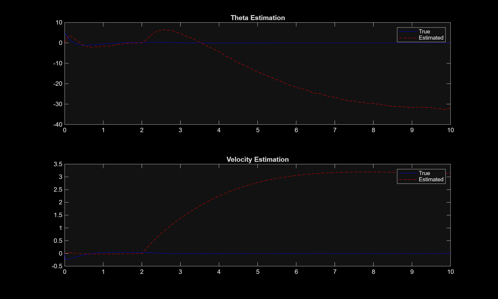
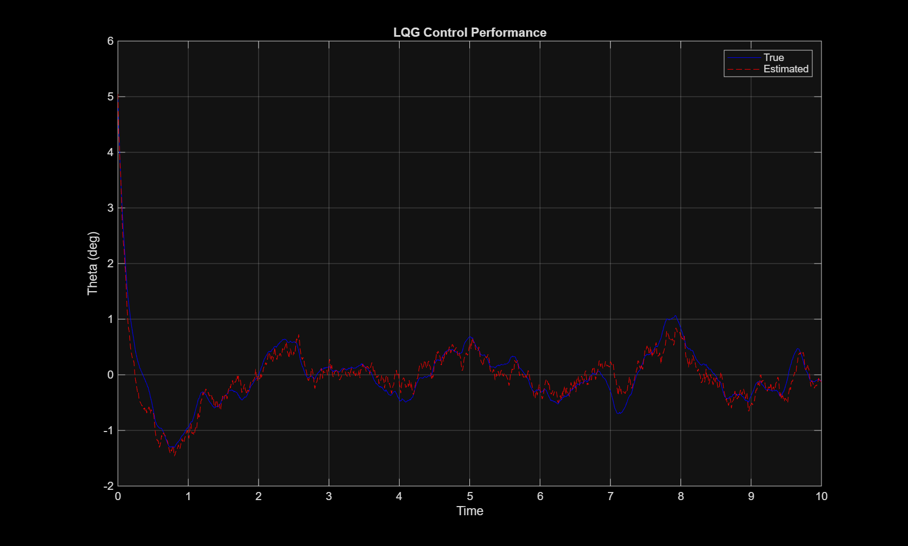

# Inverted Pendulum Control using LQR and Kalman Filter (LQG)

## Overview
This project presents the modeling, control, and state estimation of an inverted pendulum system using MATLAB.

The system is stabilized using a Linear Quadratic Regulator (LQR), and a Kalman Filter is implemented to estimate system states under noisy measurements. Together, they form a Linear Quadratic Gaussian (LQG) control system, widely used in real-world engineering applications.

---

## Objectives
- Develop a state-space model of a dynamic system  
- Design an optimal controller using LQR  
- Analyze system stability, controllability, and observability  
- Evaluate disturbance rejection and control effort  
- Implement state estimation using a Kalman Filter  
- Integrate control and estimation into an LQG framework  

---

## System Description

The system consists of a cart that moves horizontally with an attached pendulum.

### State Vector
x = [x, x_dot, theta, theta_dot]

Where:
- x: cart position  
- x_dot: cart velocity  
- theta: pendulum angle  
- theta_dot: angular velocity  

### Measurements
Only partial states are measured:
- Cart position  
- Pendulum angle  

---

## Mathematical Model

The system is represented in state-space form:

x_dot = A x + B u  
y = C x  

Where:
- A, B, C, D are system matrices  
- u is the control input  

---

## Controller Design (LQR)

The control law is defined as:

u = -K x  

The LQR controller minimizes a cost function that balances:
- state deviation (Q matrix)  
- control effort (R matrix)  

---

## Disturbance Analysis

A step disturbance is applied to evaluate:
- robustness of the controller  
- ability to reject external inputs  

---

## Control Effort

The control input is analyzed to understand:
- magnitude of force applied  
- trade-off between performance and effort  

---

## State Estimation (Kalman Filter)

Since all states are not directly measurable, a Kalman Filter is used to estimate the full state vector:

x_hat = estimated state  

The filter combines:
- model-based prediction  
- noisy measurements  

---

## LQG Control

The final control law uses estimated states:

u = -K x_hat  

This represents a realistic control system where:
- measurements are incomplete  
- estimation is required  

---

## Results

### Angle Response (Initial Condition vs Disturbance)

### Control Effort

### Kalman Filter Estimation

### LQG Control Performance

---

## Real-World Relevance

The concepts implemented in this project are directly applicable to:

- Vehicle stability control systems  
- Automotive state estimation  
- Sensor fusion  
- Friction estimation in braking systems  
- Autonomous vehicle control  

---

## Tools Used

- MATLAB  
- Control System Toolbox  

---

## Key Concepts

- State-space modeling  
- LQR control  
- Kalman filtering  
- Observer design  
- LQG control  
- Disturbance rejection  

---

## Summary

This project demonstrates a complete control system pipeline:

Modeling → Control Design → Disturbance Analysis → State Estimation → Integrated Control

---

## Author

Name: Nikhil Katti 
GitHub: https://github.com/nikhilkatti99-eng
